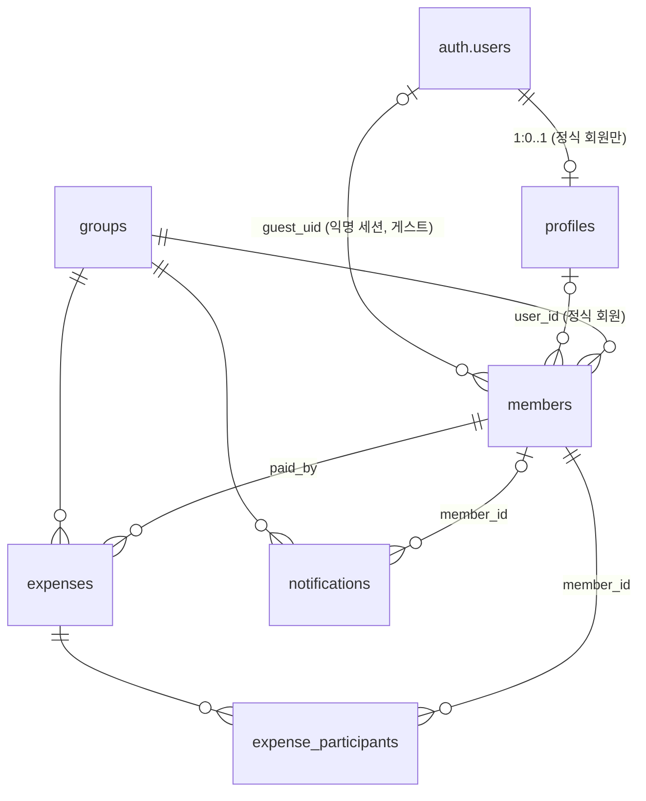

# 데이터 스키마

## 엔티티 목록

- User — 이메일로 가입한 정식 회원. 게스트 참가자는 User가 아니라 Member로만 존재함 ([conventions.md](conventions.md#정식-회원--게스트-참가자) 참고)
- Group — 정산 그룹(여행 단위)
- Member — 그룹에 속한 인원. 정식 회원(`userId` 있음)이거나, 게스트 또는 아직 앱에 가입하지 않은 "미가입 멤버"(`userId` 없이 이름만 있는 placeholder — 게스트와 데이터 구조가 동일함) 일 수 있음 ([12-group-invite.md](12-group-invite.md) 참고)
- Expense — 그룹 내 지출 1건
- ExpenseParticipant — 지출 1건에 대한 참여자 1명의 분담 정보
- Notification — 그룹 내 이벤트(지출 등록, 멤버 참여) 알림 1건

## User

> ✅ 로그인 방식 확정 (2026-09-12, sep10 프로토타입 기준): **이메일+비밀번호만 지원, 구글·카카오 연동 로그인은 스펙에서 제외**. `googleId`/`kakaoId` 필드 삭제.
>
> ✅ 게스트 모델 확정 (2026-09-12): 게스트는 `User` row를 아예 만들지 않음 — PIN 등 별도 인증도 없음. 초대코드로 참여할 때 이름만 입력하면 `Member`(아래 참고)로만 존재함. 자세한 내용은 [06-join-group.md](06-join-group.md) 참고.

로그인([01-login.md](01-login.md)) 후 최초 1회 온보딩([02-onboarding.md](02-onboarding.md))에서 생성됨. 게스트는 [06-join-group.md](06-join-group.md)의 초대코드 참여 시점에 생성됨.

| 필드 | 타입 | 설명 |
|---|---|---|
| id | string | 내부 식별자 (`uid('u')`로 생성) |
| authProvider | 'email' | 계정 종류. 항상 'email' (구글·카카오 연동은 스펙에서 제외, 2026-09-12). 게스트는 `User` row 자체가 없으므로 이 값이 필요 없음 |
| email | string | 회원 식별자(UNIQUE) |
| emailVerified | boolean | 이메일 인증 여부. 인증 필수화 여부는 미정([01-login.md](01-login.md) 참고) — 기본값 false |
| passwordHash | string | bcrypt 해시 |
| name | string | 이름. 회원가입 시 직접 입력, 온보딩/프로필에서 수정 가능 |
| bank | string \| null | 은행명. [공통 은행 목록](conventions.md#은행-목록) 중 하나. 게스트는 null |
| account | string \| null | 계좌번호. 형식 검증 없는 자유 텍스트 (현재 프로토타입 기준). 게스트는 null |
| seenGroupCreateCoach | boolean | 첫 그룹 생성 코치마크([03-group-list.md](03-group-list.md))를 이미 봤는지 여부. 1회성 안내 노출 제어용. 게스트는 해당 화면에 진입하지 않으므로 미사용 |

> `email`은 회원가입 시 중복 체크로만 쓰이는 UNIQUE 식별자. 소셜 로그인 연동이 없어 계정 자동 매칭/탈취 위험 시나리오는 해당 없음.

## Group

그룹 목록([03-group-list.md](03-group-list.md))에서 조회, 새 그룹 만들기([05-create-group.md](05-create-group.md))에서 생성됨.

| 필드 | 타입 | 설명 |
|---|---|---|
| id | string | 내부 식별자 (`uid('g')`로 생성) |
| name | string | 그룹(여행) 이름 |
| inviteCode | string | 6자리 초대코드 ([06-join-group.md](06-join-group.md), [12-group-invite.md](12-group-invite.md)에서 사용) |
| members | Member[] | 그룹에 속한 인원 목록 |
| expenses | Expense[] | 그룹 내 지출 목록 |

> 그룹의 "총 지출", "멤버 수" 등은 별도 필드로 저장하지 않고 `members`/`expenses`를 매번 계산해서 표시함.

## Member

그룹과 참여자를 잇는 관계 엔티티(User와 별개). 정식 회원, 게스트, placeholder 멤버가 모두 이 엔티티로 표현됨.

| 필드 | 타입 | 설명 |
|---|---|---|
| id | string | 내부 식별자 (`uid('m')`로 생성). Expense.paidBy·ExpenseParticipant.memberId 등이 참조하는 안정적인 키 — `userId`는 placeholder/게스트일 때 null이라 FK로 못 씀 |
| userId | string \| null | 연결된 User.id. placeholder 멤버와 게스트는 `userId`가 없음(둘 다 계정 자체가 없음) — 정식 회원으로 참여할 때(예: 대기 중 자리를 초대코드로 차지할 때)만 채워짐 |
| groupId | string | 소속 Group.id |
| role | 'owner' \| 'member' | 그룹장 여부. 게스트와 placeholder는 항상 'member' (그룹장은 정식 회원만 가능) |
| name | string \| null | 표시 이름. `userId`가 null일 때(placeholder 또는 게스트) 사용, 정식 회원은 null(User.name 사용) |
| joinedAt | timestamp | 그룹 참여 시각 |

> ✅ 2026-09-12 확정: 게스트는 별도 `User` row나 PIN 없이, 이 `Member` 테이블에 `userId: null` + `name`만으로 표현됨 — placeholder 멤버와 데이터 구조가 완전히 동일함(초대에 응해서 "실제로 참여"했는지 여부만 다름). 재입장 시에도 그룹 멤버 목록에서 이름을 다시 고르면 그 Member로 인식되며 별도 인증 없음(스푸핑 방지 장치 없음 — 수용된 트레이드오프).
>
> **화면에 표시할 이름 결정 순서**(08~13 전반에서 공통으로 씀): `userId`가 null이면(placeholder 또는 게스트) → `Member.name`. `userId`가 있으면 정식 회원 → `User.name`.

## Expense

지출 등록/수정 폼([11-expense-form.md](11-expense-form.md))에서 생성·수정되고, 지출 목록([08-group-expense-list.md](08-group-expense-list.md))·정산([09-group-settle.md](09-group-settle.md))·요약([10-group-summary.md](10-group-summary.md))에서 조회됨.

| 필드 | 타입 | 설명 |
|---|---|---|
| id | string | 내부 식별자 (`uid('e')`로 생성) |
| groupId | string | 소속 Group.id |
| paidBy | string | 결제자의 Member.id(User.id 아님) — placeholder도 결제자로 지정될 수 있어서 항상 존재하는 Member.id를 참조 |
| title | string | 항목명 |
| amount | number | 지출 금액(원) |
| category | string | 카테고리 6종 중 하나 — [마스터 데이터](#마스터-데이터) 참고 |
| receiptImageUrl | string \| null | 영수증 사진(선택) |
| splitType | 'equal' \| 'ratio' \| 'amount' | 나누기 방식 |
| spentAt | date | 사용 날짜. 기본값 오늘 |
| createdAt | timestamp | 등록 일시 |

### ExpenseParticipant

| 필드 | 타입 | 설명 |
|---|---|---|
| expenseId | string | 소속 Expense.id |
| memberId | string | 참여자의 Member.id(User.id 아님) — placeholder도 참여자로 지정될 수 있어서 항상 존재하는 Member.id를 참조 |
| shareAmount | number \| null | 이 참여자의 분담액. `splitType`이 equal이면 null(매번 계산), ratio/amount면 등록 시점에 정수(원 단위)로 확정 저장 |

> `expenseId` + `memberId`가 합쳐서 PRIMARY KEY — 한 지출에 같은 사람이 두 번 참여자로 안 들어감.

## Notification

지출 등록, 신규 멤버 참여 이벤트를 그룹 내 사용자에게 알리는 항목. [13-notifications.md](13-notifications.md)에서 조회.

| 필드 | 타입 | 설명 |
|---|---|---|
| id | string | 내부 식별자 |
| groupId | string | 어느 그룹에서 발생한 알림인지 |
| memberId | string \| null | 이벤트를 일으킨 사람의 Member.id — 지출 등록 알림이면 결제자, 멤버 참여 알림이면 그 새 멤버 |
| type | 'expense' \| 'member_joined' | 알림 종류 — [마스터 데이터](#마스터-데이터) 참고 |
| title | string | 화면에 보여줄 문구. 생성 시점에 이름을 채워 고정 저장(이후 이름이 바뀌어도 문구는 그대로) |
| createdAt | timestamp | 생성 일시(화면엔 상대 시간으로 표시) |
| read | boolean | 읽음 여부. 기본값 false |

## 마스터 데이터

- **카테고리(6종)**: 숙소 / 식비 / 교통 / 액티비티 / 쇼핑 / 기타
- **splitType(3종)**: equal(균등) / ratio(비율) / amount(금액)
- **Notification.type(2종)**: expense(지출 등록) / member_joined(멤버 참여)
- **은행 목록**: [conventions.md](conventions.md#은행-목록) 참고

## 계산 로직

1. **잔액 계산**: 멤버별 `balance = 결제 합(paidBy 기준 amount 합) - 부담 합(참여자로 지정된 지출들의 shareAmount 합)`
2. **분담액(shareAmount) 계산**
   - `equal`: `base = floor(amount / N)`, 나머지는 참여자 전체를 memberId 오름차순으로 정렬해 앞에서부터 1원씩 추가
   - `ratio`: 입력한 %를 원 단위로 환산(내림) 후, 남는 오차를 참여자 memberId 오름차순으로 1원씩 분배
   - `amount`: 입력값을 그대로 저장
3. **최소 송금 매칭**: 채권자(balance>0)·채무자(balance<0)를 각각 금액 내림차순 정렬 후 가장 큰 채권자·채무자부터 그리디 매칭
4. **카테고리별 집계**: `Expense.category`로 그룹핑해서 합산

## 관계도

## DB 구현 (Supabase / PostgreSQL)

> 이 섹션은 실제 DB가 위 스펙을 어떻게 구현하는지의 **요약**이다. 컬럼·제약·정책의 원본은 SQL 파일이며, 둘이 다르면 SQL이 기준이다.
> - [`supabase/migrations/20260920000000_init_schema.sql`](../../supabase/migrations/20260920000000_init_schema.sql) — 테이블, RLS, 가입/탈퇴 트리거, 그룹 생성·참여 RPC
> - [`supabase/migrations/20260920000100_guest_support.sql`](../../supabase/migrations/20260920000100_guest_support.sql) — 게스트(익명 로그인) 지원. **위 파일을 먼저 실행한 뒤** 실행
>
> 적용 상태(2026-09-20): 마이그레이션 파일 작성까지 완료. Supabase 프로젝트에 실제로 적용했는지는 미확인 — 적용 전 대시보드에서 **Authentication → Sign In / Providers → "Allow anonymous sign-ins"** 를 켜야 게스트 로그인이 동작함.

### 스펙 → 테이블 대응

| 스펙 엔티티 | 테이블 | 비고 |
|---|---|---|
| User | `auth.users` + `public.profiles` | 이메일·비밀번호·이메일 인증은 Supabase Auth가 관리(`email`, `encrypted_password`, `email_confirmed_at`). 스펙의 이름/은행/계좌/코치마크 플래그만 `profiles`에 저장 |
| Group | `groups` | |
| Member | `members` | 게스트·placeholder·정식 회원이 모두 이 테이블. 게스트 세션 연결용 `guest_uid` 추가 |
| Expense | `expenses` | |
| ExpenseParticipant | `expense_participants` | 정합성 보장용 `group_id` 추가(비정규화) |
| Notification | `notifications` | |

### 스펙과 다르게 구현된 부분

- **id는 전부 uuid** — 프로토타입의 `uid('g')` 같은 문자열 대신 `gen_random_uuid()`
- **User 분리**: 스펙의 `email`/`passwordHash`/`emailVerified`/`authProvider`는 `profiles`에 없음 (Auth가 담당). 회원가입 시 `signUp`의 `options.data`로 넘긴 `{name, bank, account}`를 트리거가 `profiles`로 복사하며, 셋 중 하나라도 없으면 가입이 실패함(스펙의 "가입 시 계좌 필수")
- **게스트 구현**: 스펙의 "게스트는 User 없이 Member(`userId` null + `name`)" 를 **Supabase 익명 로그인**으로 구현. 익명 세션 id를 `members.guest_uid`에 저장해 "이 세션 = 이 멤버"로 인식함 (PIN 등 재입장 인증 없음은 스펙 그대로)
- **탈퇴 처리 정책 확정**: 지출 기록은 유지하고, 탈퇴하는 사람의 이름을 `members.name`으로 옮겨 "이름 있는 미가입 멤버"로 남김 ([04-profile.md](04-profile.md)에 미정이던 항목)
- 수치는 `bigint`(원 단위 정수), 날짜는 `date`/`timestamptz`

### 테이블 정의

**profiles** — 정식 회원 프로필

| 컬럼 | 타입 | 제약 / 기본값 | 설명 |
|---|---|---|---|
| id | uuid | PK, FK → `auth.users(id)` ON DELETE CASCADE | Auth 계정과 같은 id |
| name | text | NOT NULL, 공백 불가 | 이름 |
| bank | text | NOT NULL, 공백 불가 | 은행명 ([공통 은행 목록](conventions.md#은행-목록) — 목록 검증은 앱에서, DB CHECK 없음) |
| account | text | NOT NULL, 공백 불가 | 계좌번호 (형식 검증 없음) |
| seen_group_create_coach | boolean | NOT NULL, 기본 false | 첫 그룹 생성 안내 확인 여부 |
| created_at | timestamptz | NOT NULL, 기본 now() | |

**groups**

| 컬럼 | 타입 | 제약 / 기본값 | 설명 |
|---|---|---|---|
| id | uuid | PK | |
| name | text | NOT NULL, 공백 불가 | 그룹(여행) 이름 |
| invite_code | text | NOT NULL, UNIQUE, 기본 자동 생성 | 6자리 (헷갈리는 0/O/1/I 제외한 32자 알파벳). 그룹 생성 함수가 충돌 시 재시도 |
| created_at | timestamptz | NOT NULL, 기본 now() | |

**members**

| 컬럼 | 타입 | 제약 / 기본값 | 설명 |
|---|---|---|---|
| id | uuid | PK | 지출·참여자·알림이 참조하는 안정적인 키 |
| group_id | uuid | NOT NULL, FK → groups ON DELETE CASCADE | |
| user_id | uuid | FK → profiles ON DELETE SET NULL | 정식 회원일 때만 |
| guest_uid | uuid | FK → auth.users ON DELETE SET NULL | 게스트일 때 그 익명 세션 id. 익명 계정이 정리되면 null로 돌아가 이름만 남는 멤버가 됨 |
| role | text | NOT NULL, 기본 'member', `owner`/`member` | |
| name | text | 공백 불가 | `user_id`가 없을 때(placeholder·게스트)의 표시 이름 |
| joined_at | timestamptz | NOT NULL, 기본 now() | |

- `user_id` 또는 `name` 중 하나는 반드시 있음 / `user_id`와 `guest_uid`는 동시에 가질 수 없음
- 한 그룹에서 같은 계정(`user_id`)·같은 익명 세션(`guest_uid`)은 한 번만 멤버가 될 수 있음
- 그룹당 `owner`는 최대 1명 (unique 인덱스)
- `UNIQUE (id, group_id)` — 지출/참여자가 "같은 그룹의 멤버만" 가리키도록 복합 FK에 사용

**expenses**

| 컬럼 | 타입 | 제약 / 기본값 | 설명 |
|---|---|---|---|
| id | uuid | PK | |
| group_id | uuid | NOT NULL, FK → groups ON DELETE CASCADE | |
| paid_by | uuid | NOT NULL, FK (paid_by, group_id) → members(id, group_id) | 결제자 멤버 (같은 그룹 멤버만 가능) |
| title | text | NOT NULL, 공백 불가 | 항목명 |
| amount | bigint | NOT NULL, > 0 | 금액(원) |
| category | text | NOT NULL, `lodging`/`food`/`transport`/`activity`/`shopping`/`etc` | 숙소/식비/교통/액티비티/쇼핑/기타 |
| receipt_image_url | text | | 영수증 (선택) |
| split_type | text | NOT NULL, 기본 'equal', `equal`/`ratio`/`amount` | 나누기 방식 |
| spent_at | date | NOT NULL, 기본 오늘 | 사용 날짜 (목록 정렬·그룹핑 기준) |
| created_at | timestamptz | NOT NULL, 기본 now() | |

- 인덱스: `(group_id, spent_at desc, created_at desc)` — 지출 목록 조회용

**expense_participants**

| 컬럼 | 타입 | 제약 / 기본값 | 설명 |
|---|---|---|---|
| expense_id | uuid | PK(복합), FK (expense_id, group_id) → expenses ON DELETE CASCADE | |
| member_id | uuid | PK(복합), FK (member_id, group_id) → members | 참여자 멤버 |
| group_id | uuid | NOT NULL | 지출과 멤버가 같은 그룹인지 복합 FK로 보장하려고 둔 비정규화 컬럼 |
| share_amount | bigint | ≥ 0 또는 null | `equal`이면 null(매번 계산), `ratio`/`amount`면 확정된 원 단위 정수 |

**notifications**

| 컬럼 | 타입 | 제약 / 기본값 | 설명 |
|---|---|---|---|
| id | uuid | PK | |
| group_id | uuid | NOT NULL, FK → groups ON DELETE CASCADE | |
| member_id | uuid | FK → members ON DELETE SET NULL | 이벤트를 일으킨 멤버 |
| type | text | NOT NULL, `expense`/`member_joined` | |
| title | text | NOT NULL | 생성 시점에 이름을 채워 고정 저장한 문구 |
| read | boolean | NOT NULL, 기본 false | 알림 1건당 읽음 플래그 1개 (스펙 그대로) |
| created_at | timestamptz | NOT NULL, 기본 now() | |

### 삭제 시 동작

| 대상 | 결과 |
|---|---|
| 그룹 삭제 | 멤버·지출·알림이 함께 삭제되고, 지출에 딸린 참여자 행도 삭제됨 |
| 지출 삭제 | 그 지출의 참여자 행 삭제 |
| 멤버 삭제 | 결제자나 참여자로 쓰인 멤버는 삭제 불가 (멤버 삭제 기능은 스펙에 없음) |
| 회원 탈퇴 | 삭제 직전 트리거가 이름을 `members.name`으로 복사 → `user_id`가 null로 바뀌며 이름 있는 미가입 멤버로 남음. 지출/정산 기록 유지 |
| 익명 계정 정리 | 해당 멤버의 `guest_uid`만 null이 됨 (이름·기록 유지) |

### 접근 권한 (RLS)

모든 테이블에 RLS가 켜져 있고 `anon`(로그인 전) 역할은 전부 차단됨. 아래 "멤버"는 `user_id` 또는 `guest_uid`가 내 `auth.uid()`인 멤버(정식 회원·게스트 모두).

| 테이블 | 조회 | 쓰기 |
|---|---|---|
| profiles | 내 프로필 + 같은 그룹 멤버의 프로필(정산 화면에서 송금 계좌를 보여줘야 해서 게스트도 포함) | 내 프로필만 수정. 생성은 가입 트리거만 |
| groups | 멤버 | 그룹장만 수정·삭제. 생성은 `create_group()`만 |
| members | 같은 그룹 멤버 | 멤버 누구나 이름만 있는 미가입 멤버(placeholder) 추가 가능. 참여·그룹장 지정은 RPC만 |
| expenses, expense_participants | 같은 그룹 멤버 | 같은 그룹 멤버 누구나 등록·수정·삭제 |
| notifications | 같은 그룹 멤버 | 같은 그룹 멤버가 추가·읽음 처리 |

### 트리거 · 함수(RPC)

| 이름 | 용도 |
|---|---|
| `on_auth_user_created` (트리거) | 회원가입 시 `raw_user_meta_data`의 name/bank/account로 `profiles` 생성. 익명 로그인은 건너뜀 |
| `before_profile_delete` (트리거) | 탈퇴 시 멤버 행에 이름 보존 |
| `create_group(p_name)` | [05](05-create-group.md) 그룹 + 그룹장 멤버를 한 번에 생성, group id 반환. **정식 회원만**(게스트 거부) |
| `lookup_group_by_code(p_code)` | [06](06-join-group.md) 초대코드 확인 + [07](07-join-match.md) "나 고르기" 목록용 `{id, name, members[{id, name, claimed}]}` 반환. 잘못된 코드면 null |
| `join_group(p_code, p_member_id, p_name)` | [06](06-join-group.md)/[07](07-join-match.md) 초대코드 참여. 정식 회원·게스트 공용 — `p_member_id`가 있으면 그 자리를 내 것으로, 없으면 새 멤버로 추가(게스트는 `p_name` 필수). 이미 멤버면 기존 멤버 id 반환. 새 멤버가 생기거나 정식 회원이 자리를 채울 때만 참여 알림 생성 |
| `is_group_member`, `is_group_owner`, `shares_group_with`, `is_anonymous_user` | RLS용 헬퍼 |

### 앱 연동 규칙

- **회원가입**: `signUp({ email, password, options: { data: { name, bank, account } } })` — 회원가입 1단계([01](01-login.md))·2단계([02](02-onboarding.md)) 입력값을 2단계 완료 시점에 한 번에 전달
- **게스트 참여**: `signInAnonymously()` → `join_group(code, null, 이름)` (새 참여) 또는 `join_group(code, memberId)` (기존 자리 선택·재입장)
- **개인화 초대코드** `코드-멤버ID`: 앱이 `-`로 잘라 코드는 `join_group`의 첫 인자, 멤버ID는 두 번째 인자로 전달
- **앱에서 직접 처리하는 것**: 지출 등록 알림 생성(`notifications` insert), `share_amount` 규칙(균등이면 null, 비율/금액이면 확정값 — 다른 테이블 값에 의존해서 CHECK로 못 검), 은행 목록·계좌번호 형식 검증

### 알려진 제한 · 미결정

- **알림 읽음이 알림 1건당 하나** — 그룹원이 여러 명이면 한 명이 읽으면 다른 사람에게도 읽음으로 보임. 사용자별 읽음이 필요하면 스펙과 테이블을 함께 바꿔야 함
- **같은 그룹 멤버끼리 서로의 은행·계좌번호를 조회할 수 있음** — "보낼 사람에게만 보이기"는 화면에서만 제한됨. 데이터 수준 제한이 필요하면 뷰/함수 추가 필요
- **익명 계정 남용 방지** 미설정 — 실서비스 전 CAPTCHA/레이트리밋 필요
- **게스트 사칭 가능** — 재입장 시 본인 확인이 없어 같은 그룹의 누군가가 이름을 골라 그 자리를 가져갈 수 있음 (스펙에서 수용한 트레이드오프)

## 변경 이력

- 2026-09-06: 참가자용 닉네임+PIN 게스트 분기 결정에 따라 User의 로그인 방식을 카카오로 확정(`kakaoId`, `authProvider` 추가)하고, Member에 게스트 인증 관련 필드(`nickname`/`pinHash`/`failedAttempts`/`lockedUntil`) 추가 (민선)
- 2026-09-06: 로그인 기본 수단을 카카오 단독에서 이메일+비밀번호 기본, 구글·카카오 연동 추가로 전환. User에 `email`/`emailVerified`/`passwordHash`/`googleId` 추가, `authProvider`에 `'email'`/`'google'` 추가 (민선)
- 2026-09-10: 08~13 화면(지출/정산/요약/폼/초대/알림) 스키마를 이 문서에 통합. Member에 `id` 추가(Expense.paidBy 등이 참조할 안정적인 키가 없어서), Expense 필드 채움, ExpenseParticipant·Notification 엔티티 추가, 마스터 데이터/계산 로직 섹션 추가. 은행계좌는 별도 엔티티로 분리하지 않고 User.bank/User.account 그대로 유지
- 2026-09-12: sep10 프로토타입 기준으로 **구글·카카오 연동 로그인을 스펙에서 제외**. User에서 `googleId`/`kakaoId` 필드 삭제, 소셜 계정 자동 연동/탈취 위험 관련 서술 삭제 (민선)
- 2026-09-12: **게스트 재입장 PIN 인증을 스펙에서 제외** 확정. 게스트는 `User` row 자체를 만들지 않는 것으로 모델 단순화 — User.authProvider에서 `'guest'` 제거(항상 `'email'`), Member에서 `nickname`/`pinHash`/`failedAttempts`/`lockedUntil` 필드 삭제(게스트는 placeholder와 동일하게 `userId: null` + `name`으로만 표현). "이름 표시 순서"를 2단계(`userId` 없음→Member.name, 있음→User.name)로 단순화 (민선)
- 2026-09-20: **게스트 → 정식 회원 전환을 스펙에서 제외** — `upgrade_guest` 함수와 전환 순서 서술 삭제. 게스트는 일반 로그인/회원가입만 쓰고, 게스트 기록은 새 계정으로 이관하지 않음
- 2026-09-20: Supabase DB 구현 정리 추가. 관계도(ER) 작성, 스펙→테이블 대응, 테이블 정의, RLS·RPC·삭제 동작, 앱 연동 규칙과 알려진 제한을 "DB 구현" 섹션에 기록. SQL 원본은 `supabase/migrations/` (민선)
